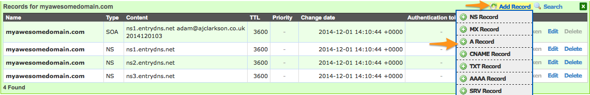

While it is possible to get a whole slew of free dynamic dns host names online, they all come in a format of: `myawesomehostname.theircompany.com` or some other variation. These services are great for providing you remote access to a home machine, or some other location without a static IP, but I really wanted to find a way of using my own domain name to various non-static services.

## The Issue
Domain Registrars generally let you use their name servers for your domain, and if you are pointing to a static IP, everyone is happy. Simply point it, wait for the dreaded propagation to happen, then away you go. They don't however, provide easy ways of updating which IP your domain points to (without logging into a web interface, for example). This makes using your own domain name for a non static IP very cumbersome, and would mean you would need to discover the newly assigned IP before you could point your domain to it, not very practical I'm sure you will agree.

So if I've already bought my domain name, why should I pay someone else to let me dynamically update it, or settle for using one of their domains?

## The Solution
Thankfully, it is possible using a combination of [EntryDNS](http://entrydns.net) and a simple script. **I'll just mention, I'm not affiliated with EntryDNS in anyway, it's just a really useful service.** Here's what we need to do:

1. Register EntryDNS as the nameserver for our domain name
2. Create DNS Records on EntryDNS for your domain (or subdomain)
3. Use the EntryDNS API to programmatically update the IP of your domain.

Sounds simple, right? Let's get started.

### Domain Setup
Head on over to [EntryDNS](http://entrydns.net) and create an account. Then you'll want to go ahead and "Add Domain" and enter your domain name.

**Note:** Even if you want to use a subdomain as your Dynamic DNS, you'll have to complete this step.

Click on your newly created domain, and by mousing over the "Add Record" option, you should get a window which looks like the image below:

Create an A record for your domain. If you are wanting to use a subdomain for your dynamic dns (e.g sub.myawesomedomain.com), then point this A record to the IP you want your main domain to resolve. Then repeat the steps above this time adding 'sub.myawesomedomain.com' as a domain, and create an A record for that, then follow along using that one.

### Change Your Nameservers

Your next step is to head over to your domain registrar and change the nameservers for your domain to point to the EntryDNS ones. At the time of writing this these are:

- ns1.entrydns.net
- ns2.entrydns.net
- ns3.entrydns.net

Unfortunately, you may have a bit of a wait on your hands while that change propagates. It can take up to 72 hours for your domain name to start using EntryDNS as it's nameserver.

### Getting Dynamic

Now that EntryDNS is responsible for your DNS we can start to get dynamic with it. When you created the A record for your domain, an authentication token was generated along with it. (Something like: SDsoT8ryycWzessi7pgx). This token is unique to your domain A record, and acts as authentication for the EntryDNS API, so keep it safe and secret (The one I posted I made up, so don't waste your time trying it).

EntryDNS allow you to update your domain by using one of the following two API calls:

<figure>
<pre><code class="language-bash">
# Providing IP address to update
curl -k -X PUT -d "ip=IP" https://entrydns.net/records/modify/TOKEN
# IP Address will be generated from request origin
curl -k -X PUT -d "" https://entrydns.net/records/modify/TOKEN
</code></pre>
<figcaption>Code Listing: EntryDNS API Calls</figcaption>
</figure>

By replacing `IP` and `TOKEN` where appropriate in either of those calls, your domain will be updated to point to the new IP. Dynamic DNS at it's finest. It's easy to incorporate that into a bash script or a cronjob and you are away, but if you want a slightly more advanced method of updating then read on.

### EntryDNS Updater
I originally just ran one of the API calls from above as a cronjob and had great success with using my own domain name for Dynamic DNS. However this meant that my domain was being updated constantly, regardless of whether it needed to be or not. With that in mind I developed [EntryDNS Updater](http://github.com/ajclarkson/entrydns-updater").

This is a simple python utility that checks your current IP against a cache file, and if it has changed, proceeds with the update. It reads the EntryDNS authentication tokens from a JSON file, so you can update as many domains as you like each time your IP changes.

Feel free to grab the code and try it out over [on Github](http://github.com/ajclarkson/entrydns-updater).

Quite a long post, but hopefully it will help some of you out with using your own domain for DynamicDNS, for free! I have several of these running now pointing to various services that I run from home, and it's all working fantastically.

&mdash; Adam
