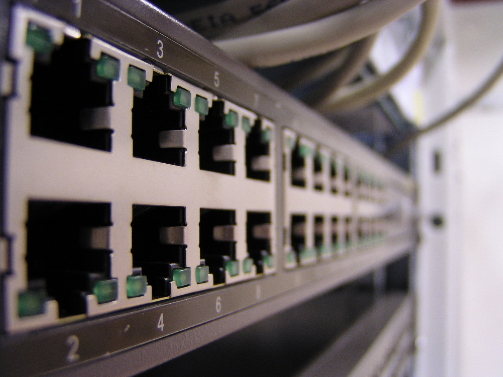

The platform for all of my home server applications and experiments always used to be a box put together of previous generation parts. It would chug along doing its thing, and then I'd break something and dread the wipe and reinstall that was inevitably awaiting. A couple of years ago I made an improvement to this by running everything in docker containers to provide a level of sandbox protection, but more improvements could be made. 

There's a couple of motivations for wanting to apply "Infrastructure as Code" principles to my home setup:

1. Having immutable and documented configuration of everything that I'm running. This makes it much easier to reproduce without relying on memory or keeping extensive (ultimately outdated) notes.

2. Changing infrastructure complexity. I'm moving away from my server box and experimenting more with Raspberry Pis, meaning that my home setup is no longer just one box to manage.

## Enter, Ansible

If you have worked with any automation of server provisioning before, then you've most likely heard of [Ansible](https://github.com/ansible/ansible). It's an open source python tool that makes configuration and application management as easy as writing a set of YAML files. 

Installing ansible was as simple as issuing a `pip install ansible` command, and then it's time to start writing configurations.